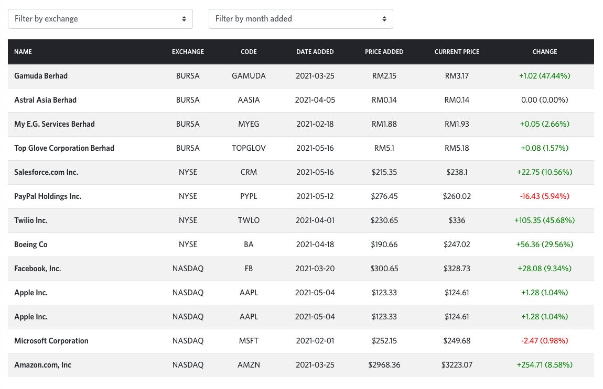

# Question 3

Based on the requirements below, create a Vue project via vue Single File Components (SFC). Feel free to use the Vue CLI. You are free to use component states and/or vuex to build the web application.
Requirements
Given the data below, generate a table to display the records as shown in the example:

# Answer

**Details**
- Project was generated using Vue CLI, Vue3 and written in Typescript.
- Ant Design Vue was chosen as the design framework for this project.

**Test Link**
- https://affin-hwang-test-zaki-hanafiah.surge.sh

[Back to Main](../../README.md)